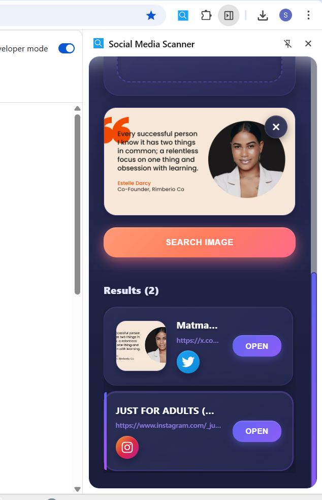
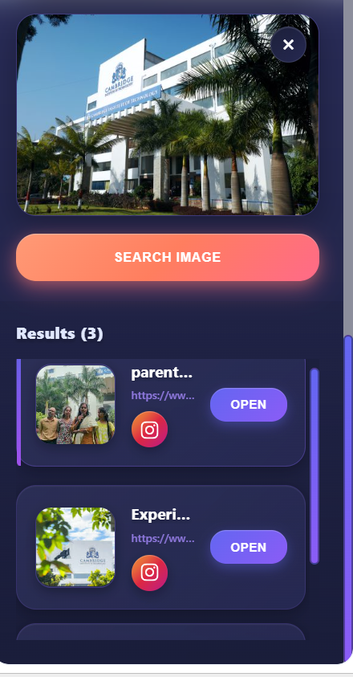
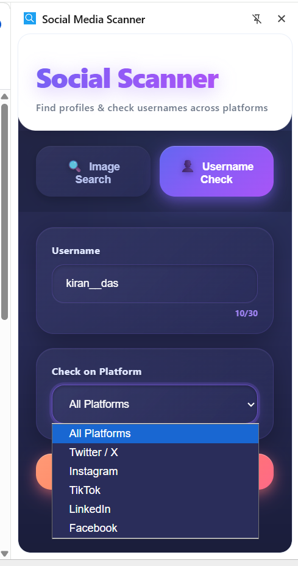
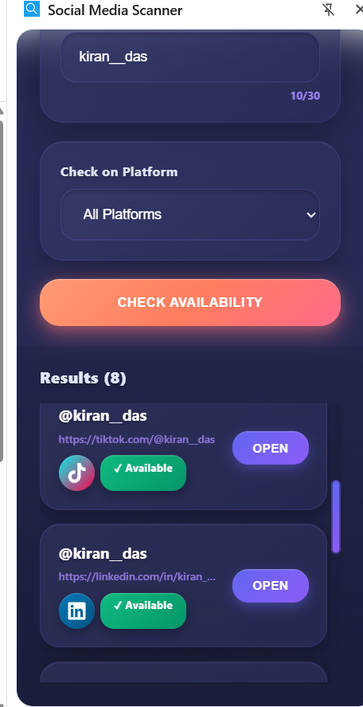
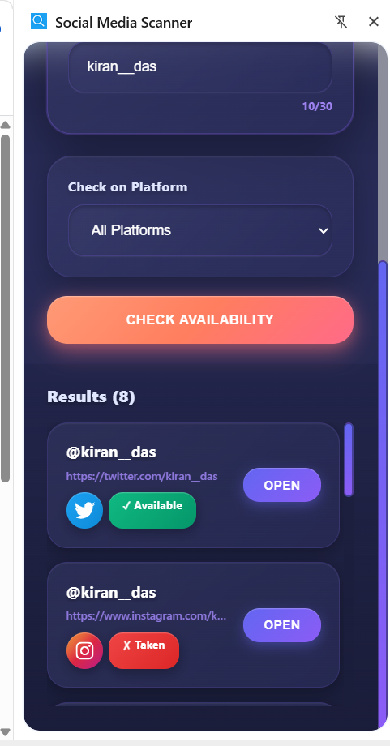

# 🔍 Social Media Scanner - Chrome Extension

A Chrome extension that helps you find social media profiles using reverse image search and check username availability across multiple platforms (Twitter, Instagram, TikTok, LinkedIn, Facebook). Built with React and modern web technologies for a beautiful, professional user experience.

---

## 🚀 How to Run

```bash
# 1. Install dependencies
npm install

# 2. Build the extension
npm run build

# 3. Load in Chrome
# - Open chrome://extensions/
# - Enable "Developer mode"
# - Click "Load unpacked"
# - Select the "dist" folder
```

---

## 📖 Step-by-Step Guide

### Step 1: Extension Landing Page
When you click the extension icon, the side panel opens with a beautiful interface featuring an animated gradient header and two main options.


---

### Step 2: Upload Image or Enter URL
Choose between uploading an image file or pasting an image URL. The drag-and-drop zone makes it easy to upload images directly.


---

### Step 3: Image Search Across Social Media (Part 1)
After searching, the extension displays results from various social media platforms. Each result shows the platform icon, title, and a link to open the profile.



---

### Step 4: Image Search Across Social Media (Part 2)
Continue scrolling to see more results. The extension filters and displays only social media profiles, making it easy to find the person across different platforms.



---

### Step 5: Username Availability Check
Switch to the "Username Check" tab to verify if a username is available. Enter the username and select which platforms to check.



---

### Step 6: Username Availability Results (Part 1)
View the availability status for each platform. Green badges show "Available" and red badges show "Taken" with links to existing profiles.



---

### Step 7: Username Availability Results (Part 2)
If a username is taken, the extension automatically suggests alternative usernames that are available on multiple platforms.



---

## 🛠️ Technologies Used

- **React 18** - Modern UI framework
- **Framer Motion** - Smooth animations
- **React Icons** - Social media logos
- **SerpAPI** - Reverse image search & username checking
- **Chrome Extension API** - Side panel integration

---

## 📝 Features

- ✅ Reverse image search across social media
- ✅ Username availability checker
- ✅ Beautiful glassmorphism UI design
- ✅ Smooth animations and transitions
- ✅ Platform-specific icons and badges
- ✅ Automatic username suggestions
- ✅ Results caching for faster searches

---

**Built with ❤️ using React and modern web technologies**
